# 学生宿舍管理系统

该系统项目为学生宿舍管理系统，可以帮助学生和老师进行宿舍管理。系统一共分为两个部分，分别是管理员操作系统和学生操作系统。管理员与学生相区分。

## 1功能介绍

该学生宿舍管理系统分为学生和管理员两部分，二者的功能均有差距。管理员使用正确的账户密码登陆时可以使用寝室卫生登陆功能。该功能可以用于记录学生寝室的卫生分数（记录时需要填写学生的姓名、学号、寝室号、登记日期和卫生分数）。学生使用正确的账户密码登陆时可以使用寝室保修功能。该功能可以记录住宿学生的保修记录以供相关人员查看，并且学生需要填写姓名、学号、寝室号、保修日期和保修备注，即需要保修的物品。

## 2数据库的构建介绍

该学生宿舍管理系统由四个数据库管理并记录数据，分别是学生注册信息数据库、管理员信息数据库、卫生登记数据库和保修登记数据库。其中学生注册信息数据库记录注册学生的账户和密码，在学生注册时记录。管理员信息数据库记录管理员的账户和密码，管理员不可注册，账户密码信息通过managersys.mongodb来生成。卫生登记数据库记录学生的寝室卫生，学生姓名，学生学号，登记日期和寝室号。保修登记数据库记录学生的保修物品，学生姓名，学生学号，登记日期和寝室号。

## 3引入的包说明

该系统使用express框架进行路由选择和网页跳转，结合ejs进行渲染并使用mongoose帮助简单快速操作mongodb数据库。

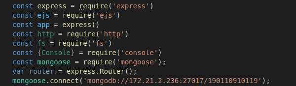

## 4使用流程简介

进入登录和注册界面

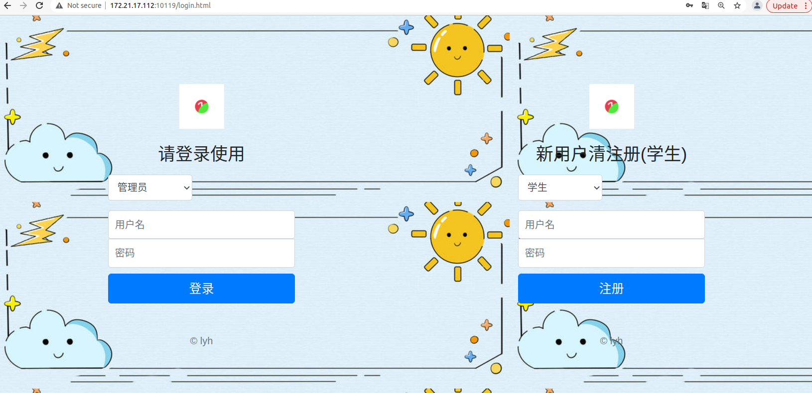

注册功能（仅学生可注册）

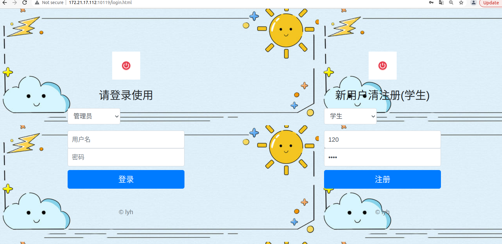

点击注册，并将下拉框选择为学生后使用正确的账户密码进行登陆

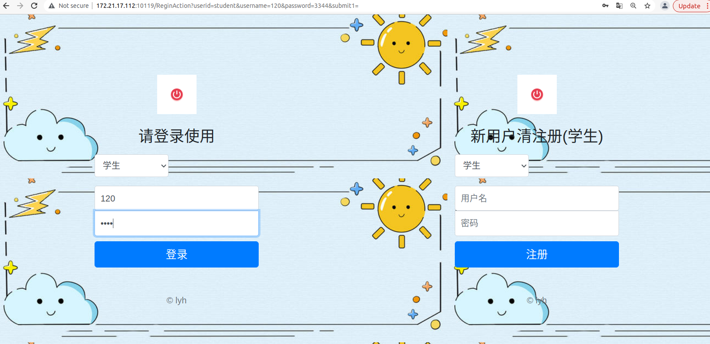

登录后进入学生操作系统

点击寝室保修登记，可以使用保修登记功能

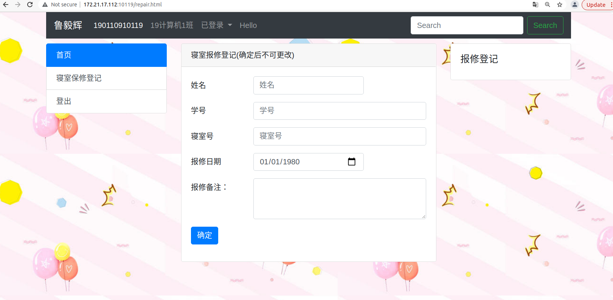

输入相关信息后，点击确定即可提交保修信息

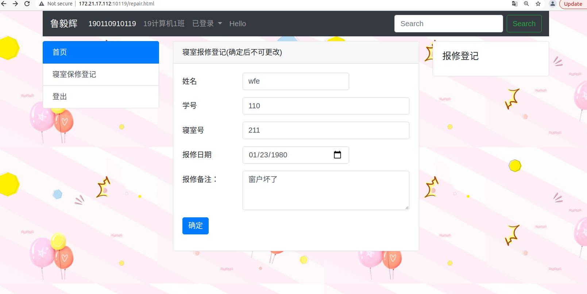

点击登出或者已登录下拉框的“注销”即可退出

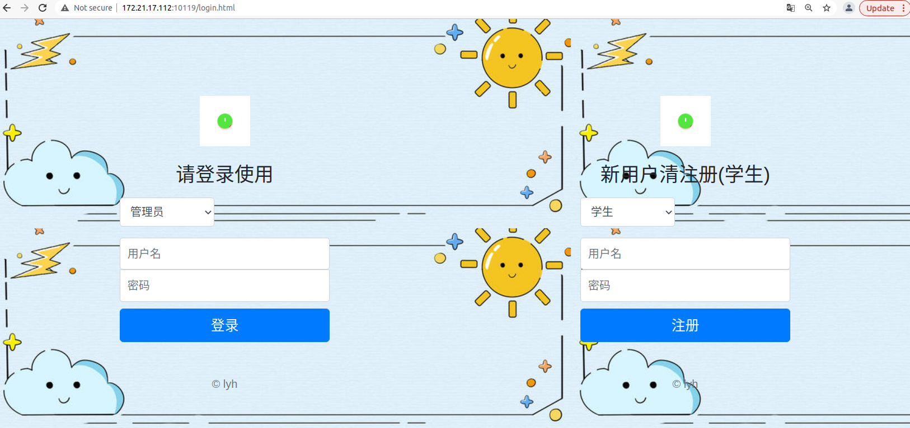

输入正确的账户密码并将下拉框选择为管理员即可进入管理员操作系统

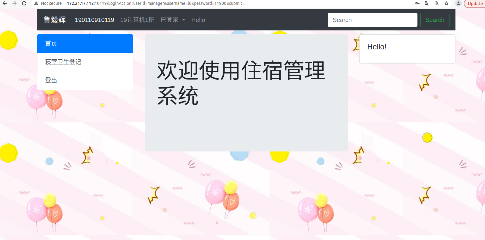

点击寝室卫生登记即可使用卫生登记功能

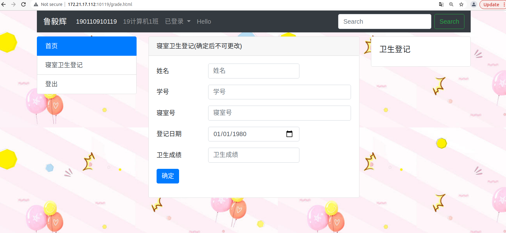

填写正确的信息后点击确定即可登记卫生

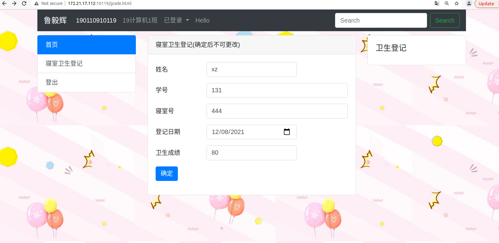

点击登出或者已登录的下拉框选择“注销”即可退出

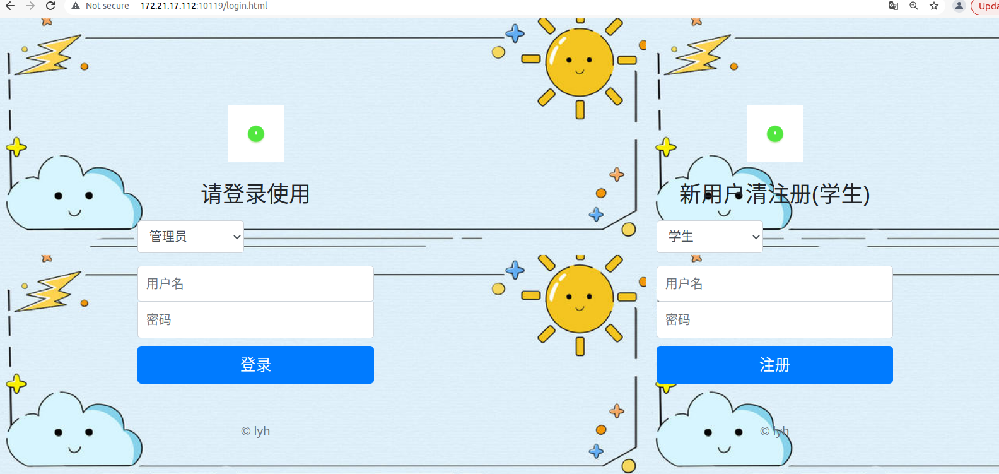